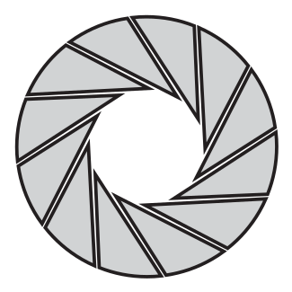

<h2 align="center">
  <!--  <br> -->
  <b style="font-size: 26px">DeepDS: Python Tool for Data Creation for Deep Learning & Computer Vision<b> <br>
</h2>
<p align="center">
Grab your coffee and let me do the boring intelligent task :grinning:
</p>
  

&nbsp;
	  
DeepDS is an **automatic Video Processing Python** tool that provides an easy-to-use command line interface to autoamte your data creation process for various machine learning / computer vision tasks. It uses **OpenCV** and **VidGear** at the backend and uses **Optimized Deep Learning** algorithm to analyze and create your datasets with just a single command. 

DeepDs primarily focuses on automation of repetetive tasks, and thereby lets ML practitionars & researchers/developers to easily create image datasets from online/offline videos. Additionally you can use your own trained ML models for custom dataset creation tasks.

NOTE: Please read about Weak Annotations & keep it mind that default model might not provide good predictions. Use it only for pre-training or if you have a custom model, use that for data creation.
    
The output of the data creation project will be directories containing images that are ready to be used for finetuning/training your ML models
   
```
custom_dataset/
    ├── class1/
    │   ├── image1.jpg
    │   ├── image2.jpg
    │   └── ...
    ├── class2/
    │   ├── image1.jpg
    │   ├── image2.jpg
    │   └── ...
    ├── class3/
    │   ├── image1.jpg
    │   ├── image2.jpg
    │   └── ...
    └── ...
```
&nbsp;    
    
<!-- ## Build datasets for computer vision

You can use this script to create datasets with weak image annotations. -->

## Why Weak Annotations?
	  
Labeling images is a time consuming process. In computer vision, classification labels are the easiest one to annotate input data for ML models. While bounding boxes (detection/localization) and segmentation (semantic/instance) are hard and tedious plus time consuming task. 

Capturing individual images is a lot more time consuming process than capturing videos. This scripts accepts a video (local or YouTube video support) and allows to develop a dataset in ImageNet style annotations. Where each frame in the video is classified using a OpenVino optiimzed model (currently supports InceptionV3). Based on this information individual folders are created and associated images are transferred to the corresponding folders.

Once you have dataset, you can simply annotate these images for Detection/Segmentation tasks. For classification, custom models are required, but using a ImageNet model might help in weak labels. The generated dataset can be used in Unsupervised/Self-supervised settings to pre-train a vision model. After that a small amount of labeled data is enuogh to train robust vision models.

The current InceptionV3 model is optimized for CPU so it's performance is not comparable with SOTA classification models. However, the predictions from this model are good enough to be used in weakly supervised training.

## Prerequisites

Create a new virtual environment. For creating a new environment follow the instructions below:

To create and activate a virtual environment in Windows, follow these steps:

1. Open a command prompt:
2. Press the Windows key and type "cmd".
3. Press Enter and create a virtual environment using following command:
```
python -m venv myenv
```
Replace "myenv" with the desired name for your virtual environment.

4. Activate the virtual environment:
```
myenv\Scripts\activate
```
Replace "myenv" with the name you provided in the previous step.

5. After executing these commands, your virtual environment will be created and activated. Once the virtual environment is ready just run the following command:

```
pip install -r requirements.txt
```
6. For [MacOS](https://programwithus.com/learn/python/pip-virtualenv-mac) and [Linux](https://www.geeksforgeeks.org/creating-python-virtual-environment-windows-linux/) please follow the instructions for creating & activating the virtual environment.

Usage
---
Use cli.py file if you do not want to manually modify the main script.
```
>>> python cli.py --help
>>> usage: DeepDS [-h] --video_path VIDEO_PATH --destination DESTINATION [--displayframe] [--custom_model CUSTOM_MODEL]
              [--labels LABELS]

Python script to auto generate datasets for computer vision applications.

optional arguments:
  -h, --help            show this help message and exit
  --video_path VIDEO_PATH	    ||  Target video link to YouTube video or local video path.
  --destination DESTINATION  	    ||  Target destination to save dataset.
  --displayframe             	    ||  Display the frames currently being processed.
  --custom_model CUSTOM_MODEL       ||  Path to your custom model.
  --labels LABELS       	    ||  Path to your labels file.

Powered by deeplearning
```

Example run
---

```
 >>> python cli.py --video_path "https://www.youtube.com/watch?v=ffCWuQhj9Fo" --destination "D:\\dataset\\test2\\" --custom_model "D:\\dataset\\bees_keras_model.h5" --labels "D:\\dataset\\labels.txt"
```
If you do not provide trained model and labels path, the script will automatically load ImageNet labels and pre-trained Intel OpenVino optimized Inception model for classification.
Optionally, you can provide ``` --displayframe ``` argument in command line if you want to display current frames.

``` 
>>> python cli.py --video_path "https://www.youtube.com/watch?v=ffCWuQhj9Fo" --destination "D:\\dataset\\test2\\" --custom_model "D:\\dataset\\bees_keras_model.h5" --labels "D:\\dataset\\labels.txt" --displayframe
```

NOTE: Make sure ``` --video_path ```, ``` --destination ```, ``` --custom_model ```, ``` --labels ``` are strings (enclosed in quotation marks)

## LIcense
	  
This project is licensed under the [MIT License](https://github.com/qaixerabbas/deepds/blob/master/LICENSE).

## Acknowledgments
	  
This script was developed with the help of various open-source libraries and resources. I would like to acknowledge their contributions to the project:
- OpenCV: https://opencv.org/
- VidGear: https://github.com/abhiTronix/vidgear
- OpenVino: https://github.com/openvinotoolkit/openvino
- PyTorch: https://github.com/pytorch/pytorch

## Limitations
	  
1. Currently, It only works with the OpenVino optimized model (.xml) files or your custom trained keras (.h5) models.
2. I have not tested on GPU so it might need some modifications to run on GPU.
3. Custom keras models take longer time to generate dataset (as the tool reads video and classify each frame).
4. Default model is somehow fast, but it is not very efficient.
5. It (Default Model) only works with images from ImageNet dataset. Any image category that isn't available in ImageNet will be ignored and randomly(upto some threshold) assigned image class.
6. If you want to use a custom model, it should be in Keras trained model.

## What Next?
- Follow this [FastAI Image Classification](https://towardsdatascience.com/image-classification-using-fastai-v2-on-colab-33f3ebe9b5a3) tutorial to make a custom image classification model for your newly prepared image dataset. 

## Todo

- [ ] Add a flag for skipping frames in video streams.
- [ ] Work with any online videos.
- [ ] Add train_test_split function.
- [ ] Add support for PyTorch Models.
<!-- - [ ] Add support for loading open source datasets -->

## In Progress

- [ ] Working on improving readme.

## Done ✓

- [x] Capture frames from local & YouTube videos without downloading.
- [x] Create directories based on class predictions by deep learning model.
- [x] Arrange the images into a proper ImageNet based annotations.
- [x] Add a showframe argument for displaying current frames.
- [x] Add custom model support.

## 🤝 Contributing

Contributions are welcome! Feel free to open issues or submit PRs.

## Citation

If you use this code in your research or project, please consider citing it:

```
@misc{qaixerabbas/deepds,
  author = {Qaiser Abbas},
  title = {DeepDS: Python Tool for Data Creation for Deep Learning & Computer Vision},
  year = {2023},
  publisher = {GitHub},
  journal = {GitHub repository},
  howpublished = {\url{https://github.com/qaixerabbas/deepds}},
}
```

